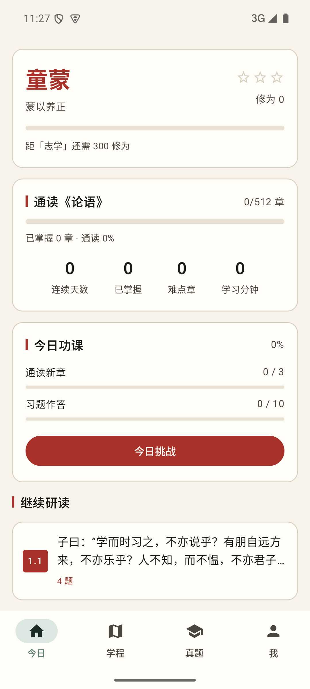
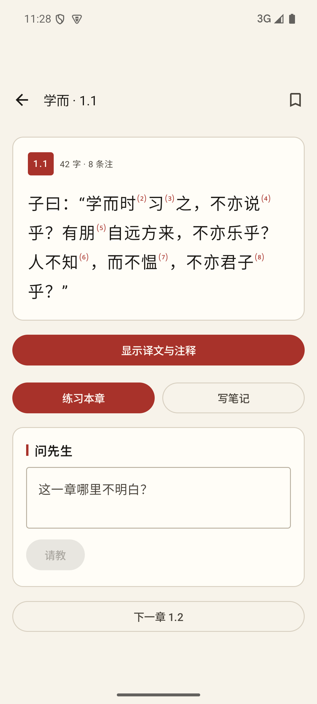
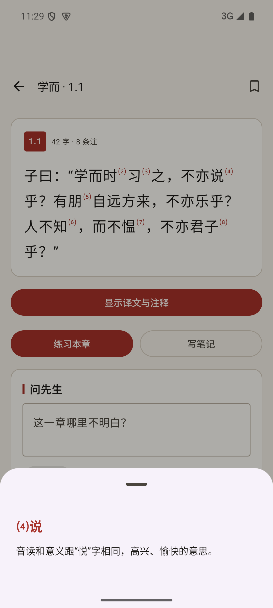
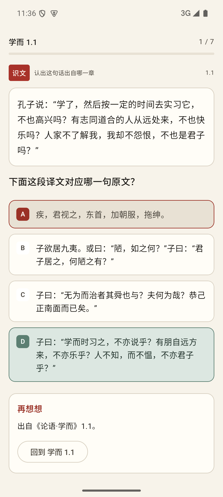
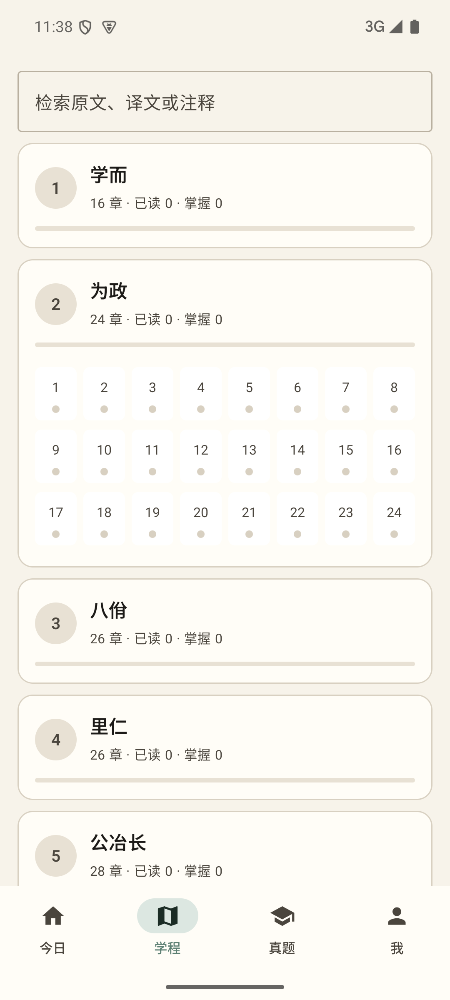
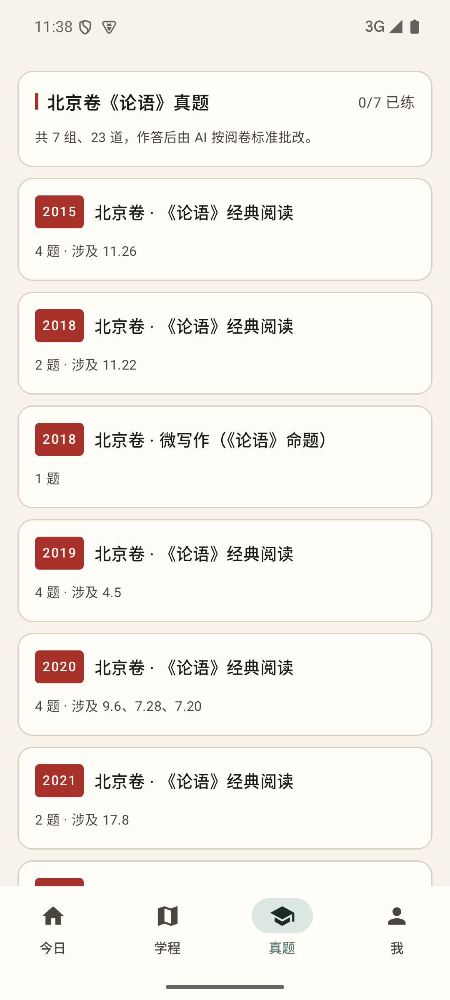
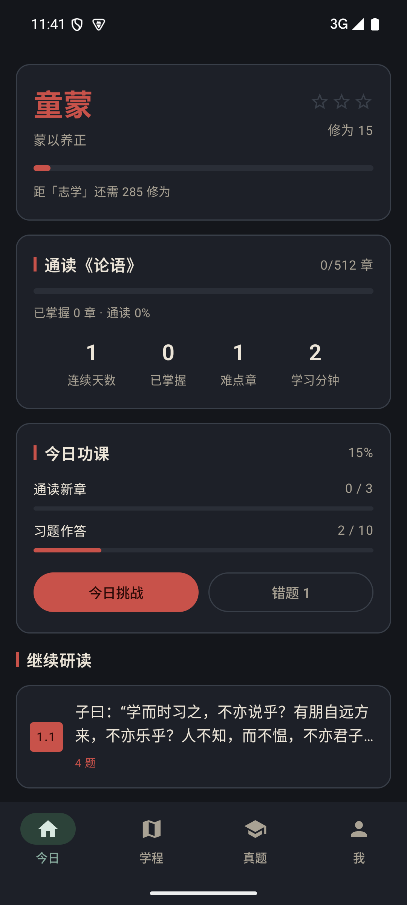
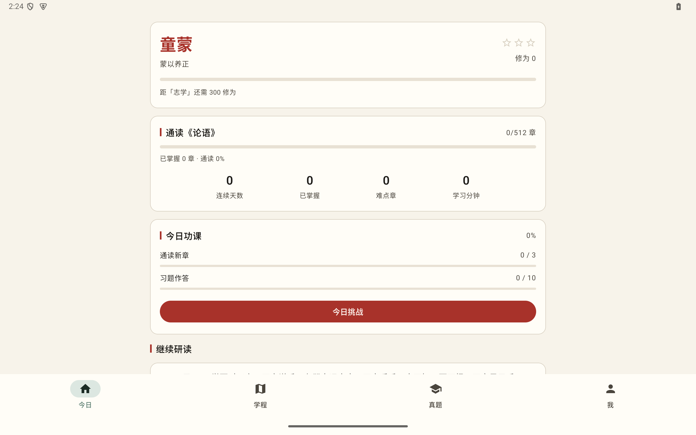

# 韦编 · 论语译注

> 韦编三绝 —— 孔子读《易》，编简的皮绳断了三次。
> 这个 App 的目标只有一个：让一个人真正读完、读懂、记住、并能运用《论语》全部 **512 章**。

一个**原生 Android 应用**（Kotlin + Jetpack Compose），不是 WebView 套壳。

当前 Direct lifecycle 为 `production-supported`。Direct R2 当前版已按 pointer-last
发布为 v1.1.2 / versionCode 4：clean source
`e65dc572af19ed99cf520d52aa01de72508680a9` 与 GitHub Actions
[run 30516534134](https://github.com/ieduer/weibian-android/actions/runs/30516534134)
通过；Direct APK 为 2,819,959 bytes，SHA-256
`956810c903005680ba2e77a2c71964956cd2beac428e840862fc0a33724e15c3`，
signer certificate SHA-256 为
`a40f3956296d09ca2c6d8c3ec23f4f1d5470cb8ca6a5d4a69a9f19eb39941282`。
同一安装身份的 Play APK 为 2,819,963 bytes／SHA-256
`7bf92fcfc4fab561aee5f2e95a4ad80d67b9c7161778a667b8f7b33cc9427f7f`，
Play AAB 为 4,988,101 bytes／SHA-256
`6a37903152ede8c5a9b4f9d547af99454cb75d501f19e3b96491969131b132a4`。

IN2020 已从保留资料的 code3 App 通过真实应用内更新链原位升级到 exact code4，
并通过资料／Session、榜单、反馈、offline/recovery、rotation/multi-window、
AI／注释、当前版本自检、补充 expanded-layout 与单一 package 核对，设备设置
已恢复。按 2026-07-30 新单机政策，IN2020 是本 release 的选定门机，
expanded-layout 可满足同机平板效果门。它又以一次性 Android 次要使用者完成
data-safe clean-profile 验收，并使用本机 env canonical 账号完成
登录→新增非计分进度→同步→冷启读回→登出→未登录冷启→重新登录读回；
Pulse 聚合进度由 7 行增至 8 行且仍为 1 位用户。LE2120 也曾原位升级到同一 code4
并通过登录、榜单与反馈，但 owner 随后叫停后续操作；其临时 Wi-Fi proxy
是否已人工恢复为 None 尚未确认，且不再是本 release 的必要门。
[GitHub v1.1.2 Release](https://github.com/ieduer/weibian-android/releases/tag/v1.1.2)
已发布且 bytes 与 R2 一致。IN2020 的 disposable user 物理验收又证明：
active 内容 byte 0 故意损坏后，exact code4 冷启会拒绝坏 slot 并把 previous
原子恢复为原 SHA；测试 user、helper、设备暂存和本机正式签名测试产物随后
全部删除，owner App 未卸载或清资料。production deployment
`3f5d9c74-593a-422b-8cbb-94ec31126b20` 已把
`1ce95b1a-e05c-4203-b082-324d6758aca5` 提升至 100%，
`e16da332-cbb5-46fd-82c8-ae7a6d4c69c0` 保留为 exact rollback。
v1.0.0 是历史上一版；v1.1.1 / code3 只保留为历史 immutable staging/baseline，
都不是当前 Direct 更新指针。

---

## 这是什么

| | |
|---|---|
| 正文 | 杨伯峻《论语译注》全本 —— **512 章**原文 + 译文 + **1045 条注释** |
| 题库 | **215 道**人工精编题（八种题型，每个错项都有诊断）+ 由语料确定性生成的原文题 |
| 真题 | 北京卷《论语》经典阅读 **7 组 23 道**（2015／2018／2019／2020／2021／2023 + 2018 微写作），含 AI 批改 |
| 概念 | 17 个核心概念、15 位孔门人物，与章句互相索引 |
| 界面 | 简体中文；原文保留文言原貌，译注分层展开 |

### 与本工作区其他《论语》项目的关系

**这是一个全新的独立原生 App，与下列项目互不相干**，只在**构建期只读地**取用它们的语料：

| 项目 | 是什么 | 与本项目的关系 |
|---|---|---|
| `kz.bdfz.net`（`CF/lunyu`） | 静态网页版 AI 论语阅读 | 提供《论语译注》全文语料（只读） |
| `ly.bdfz.net`（`CF/lunyu-battle`） | React 网页对战游戏 | 提供 215 道题库与概念表（只读） |
| `CF/lunyu-battle-android` | 上者的 **Capacitor WebView 套壳** | **无关**；本项目是纯原生重做 |
| `CF/recite-android` | 琅琅背诵 App | 参考其用户系统与更新架构 |

本项目独占：目录 `lunyu-yizhu-android/`、Kotlin namespace
`net.bdfz.weibian`、Direct/Play 共用 canonical package
`net.bdfz.weibian.direct` 与连续签名身份、siteKey `weibian`、域名
`weibian.bdfz.net`、更新通道
`img.bdfz.net/apps/weibian-android/`。

---

## 学习设计

### 三层掌握

1. **原文掌握** —— 识文（译文↔原文）、补字（挖空）、连句（乱序重排）
2. **注释掌握** —— 释词（杨伯峻注释直接命题）、核心概念、易混辨析
3. **综合理解** —— 章句关联、观点冲突、人物弟子、现实应用、误解识别

前两层由语料**确定性生成**（同章同轮次题目稳定，换轮次才换题，可复习）；
第三层来自人工精编题库。

### 掌握度不是"读过"

单章 0–100 分：读原文 20 ＋ 读译注 15 ＋ 答题正确率 45（需 ≥3 次作答才给满）＋ 复习 20。
≥80 判为掌握。**一路划到底拿不到掌握**，答对一题也不行 —— 这是刻意的。

### 段位

段位名全部取自《论语》本文：

`童蒙 → 志学 → 束脩 → 升堂 → 入室 → 博文 → 约礼 → 不惑 → 从心`

每段三星，集满第三星即晋段。修为只增不减，是本机即时学习反馈；单列的
“榜单”只统计服务端按当前授权内容
核验的人工精编题首次记录作答。每日榜按服务端北京时间接收日计入，总榜按
核验答对数累计；榜单积分／等级不与本机修为／段位混用。

---

## 快速开始

```bash
git clone <repo> && cd lunyu-yizhu-android
node scripts/bootstrap_public_content.mjs
echo "sdk.dir=$ANDROID_HOME" > local.properties
JAVA_HOME=/opt/homebrew/opt/openjdk@21 ./gradlew :app:assembleDirectDebug
```

APK 在 `app/build/outputs/apk/direct/debug/`。需要 **JDK 21**、Android SDK 37。

clean clone 先按 checked-in lock 从已授权的不可变内容对象恢复 exact bytes。
只有受控上游语料变更时才重建内容包：

```bash
/Users/ylsuen/.venv/bin/python content/build_content.py
```

详见 [开发指南](docs/DEVELOPMENT.md)。

---

## 架构一句话版

```
内容（不可变、版本化）          学习记录（可变、离线优先）
assets/content.json      ┐      Room: chapter_progress / task_attempts
weibian.bdfz.net 热更新  ┘             daily_stats / gaokao_attempts
        │                                      │
        └──→ ContentBundle (内存索引) ←────────┘
                     │
              LearningEngine（出题）
                     │
                 Compose UI
                     │
        my.bdfz.net（身份 + 进度同步）
        apis.bdfz.net（AI 讲解与批改，App 内无任何密钥）
```

**内容更新不需要发新 APK**；APK 自检更新走 `bdfz-android-update-v1` 契约。

详见 [架构文档](docs/ARCHITECTURE.md)。

---

## 文档

| 文档 | 内容 |
|---|---|
| [ARCHITECTURE.md](docs/ARCHITECTURE.md) | 分层、数据流、内容管线、同步与冲突处理 |
| [DEVELOPMENT.md](docs/DEVELOPMENT.md) | 本地环境、构建、调试、测试、模拟器 |
| [DEPLOYMENT.md](docs/DEPLOYMENT.md) | APK 签名发布、内容 Worker 部署、GitHub Release |
| [MAINTENANCE_MANUAL.md](docs/MAINTENANCE_MANUAL.md) | 运维手册与故障排查（登录／同步／更新／迁移） |
| [VERIFICATION_STANDARD.md](docs/VERIFICATION_STANDARD.md) | 八点核查标准（本机强制） |
| [SECURITY_REVIEW.md](docs/SECURITY_REVIEW.md) | v1.1.2／code 4 source freeze 安全审查与剩余 release 门 |
| [IDENTITY_ADR.md](docs/IDENTITY_ADR.md) | Direct 渠道身份流程决策 |
| [CONTRIBUTING.md](CONTRIBUTING.md) | 贡献流程与代码约定 |
| [art/README.md](art/README.md) | 美术资产体系与授权 |

---

## 内容来源与授权

- **正文与译注**：杨伯峻《论语译注》（中华书局）。《论语》原文属公有领域；
  译文与注释的著作权归原出版方；本项目已取得公开发布授权，授权依据见
  [`docs/CONTENT_RIGHTS_RECEIPT.md`](docs/CONTENT_RIGHTS_RECEIPT.md)。
- **高考真题**：北京卷历年语文真题，取自本机既有真题库。
- **代码**：MIT（见 [LICENSE](LICENSE)）。**授权仅涵盖代码，不涵盖上述语料**。
- **美术资产**：全部原创矢量绘制，无第三方素材，见 [art/README.md](art/README.md)。

---

## 已知缺口与发布证据

诚实记录，不藏着：

1. **注册**：用户中心已在服务端关闭注册（`registration-disabled`），且运维标准禁止项目自建用户表。
   因此 App 只提供**希悦账号登录**与**完整离线游客学习**；注册界面预留，服务端一旦开放即可用。
2. **上游语料缺注**：雍也 6.7、6.26 两章正文有注释标记但上游 `dialogues.json` 缺对应注释条目。
   这两处标记按纯文本渲染，不给点了没反应的目标。
3. **真题覆盖**：北京卷设《论语》大题的年份只有 6 年（其余年份考《红楼梦》），已全部收录，不是遗漏。
4. **验收范围**：LE2120 与 IN2020 的 historical code3 baseline 都曾完成真实
   A→B delta、故意拒绝 delta 后整包回落、重启 readback 与稳定 A 恢复。
   本轮两机都从 code3 通过 App updater 原位升级到 byte-identical exact code4。
   这些双机结果是超过现行单机最低门的历史补充。当前选定门机 IN2020
   另通过资料／Session、榜单、反馈、offline/recovery、Back、
   rotation/multi-window、AI／注释、current-update、single-package 与补充
   sw753dp／200% font expanded-layout，且设置已恢复，故同机平板效果门已满足。
   LE2120 只完成登录、榜单与反馈后由 owner
   叫停；临时 Wi-Fi proxy 是否已人工恢复为 None 未确认，未经重新授权不再
   触碰。IN2020 已用同机 disposable user/profile 完成 exact APK 的
   clean-profile 启动、核心内容、访客分区、手动自检与 scoped log 门，并以
   本机 env 账号完成登录／同步／登出／重启读回；临时 user、测试 package 与
   credential-bearing 临时文件均已移除。随后另用 disposable user 10 与
   同 signer 临时 instrumentation，在 owner 外建立两个相同有效 slot，只把
   active byte 0 从 123 改为 122；code4 冷启 353 ms 后 previous 已恢复为
   active 原 SHA，previous/staged/failed 全部消失，512 章 UI 与 scoped
   fatal/ANR 均通过。user 10、helper、设备暂存与所有本机签名测试产物已删除。
5. **发布边界**：v1.1.2 Direct immutable APK、同目录 `release.json`、
   `latest.apk` 和 `latest.json` 已上线并逐字节读回，pointer 最后移动；当前
   immutable URL 是
   `https://img.bdfz.net/apps/weibian-android/releases/v1.1.2/956810c9/weibian-1.1.2.apk`。
   GitHub v1.1.2 Release 的 APK 与 `release.json` digest 均一致；landing
   source commit `4829b5b…` 的 CI 已绿，Worker `1ce95b1a…` 已在 deployment
   `3f5d9c74…` 承载 100% 普通流量并通过 health/content/rankings、Pulse 与
   桌面／390 px 真实浏览器读回。当前 Direct lifecycle 为
   `production-supported`；v1.0.0 与 v1.1.1 只属历史证据。
6. **公开入口**：canonical portal 是 `https://i.rdfzer.com`，当前返回 200；
   `allinone.bdfz.net` 与 `portal.bdfz.net` 是非 canonical 别名，当前 522 不作为
   本 App 的发布入口。Companion disposition 为 `not-applicable`，不得新增
   Weibian WebView service。

---

## 界面

| 今日 | 章句 | 点注释 |
|---|---|---|
|  |  |  |

| 挑战反馈 | 学程图 | 高考真题 | 深色模式 |
|---|---|---|---|
|  |  |  |  |

> 截图取自 Android 15 模拟器（arm64），标注为 emulator-only。

平板（2560×1600）正文限宽居中：


